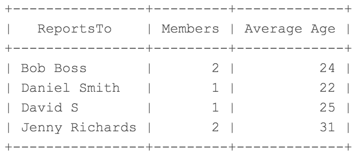

# Minds + Assembly SQL Interview

## Instructions

This example is designed to test basic knowledge and familiarity with SQL. You are allowed to use Google Docs, or any SQL editor/tool of your choice. The queries to generate the tables in SQL are located in this repo. 

### Exercise

Given the following table named :

| ID | FirstName | LastName | ReportsTo      | Position   | Age |
|----|-----------|----------|----------------|------------|-----|
| 1  | Daniel    | Smith    | Bob Boss       | Engineer   | 25  |
| 2  | Mike      | White    | Bob Boss       | Contractor | 22  |
| 3  | Jenny     | Richards | null           | CEO        | 45  |
| 4  | Robert    | Black    | Daniel Smith   | Sales      | 22  |
| 5  | Noah      | Fritz    | Jenny Richards | Assistant  | 30  |
| 6  | David     | S        | Jenny Richards | Director   | 32  |
| 7  | Ashley    | Wells    | David S        | Assistant  | 25  |
| 8  | Ashley    | Johnson  | null           | Intern     | 25  |

Write a query that returns the names of the people who are reported to (excluding null values), the number of members that report to them, and the average age of those members as an integer. The rows should be ordered by the names in alphabetical order. Your output should look like:

### Resources

If you'd like to use SQL to work in real time, please use the file from this repo that works with you preferred version of SQL. 

- source-table-mysql.sql - For mySql
- source-table-mssql.sql - For Microsoft SQL (should also work with sqllite but untested)
- source-table-postgres.sql - For Postgres